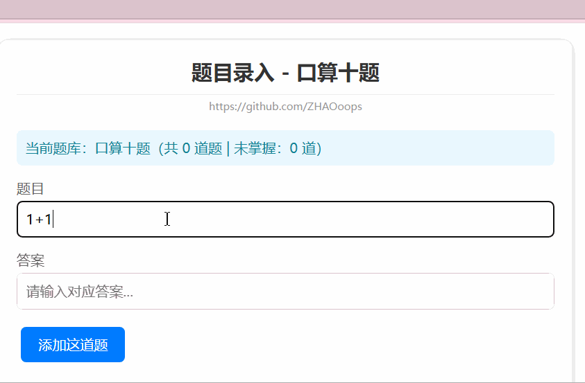
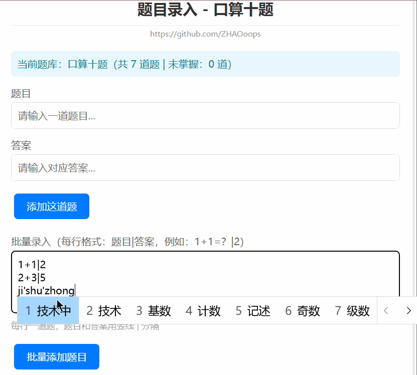

# question-review-system
轻量级题目抽查复习系统，用于知识点背诵、题库复习、错题强化等场景，纯前端实现，开箱即用！无论您是苦于期末考试的记忆型知识点的学生，还是希望尝试智能化教学的老师，都可以尝试一下！

直接打开 `index.html` 文件即可使用

  <strong>轻量级题目抽查复习系统</strong> | 单HTML文件实现，无需后端，支持多题库管理、本地持久化、导入导出
   
  📚 适用于知识点背诵、题库复习、错题强化等场景，纯前端实现，开箱即用
   
  仓库地址：https://github.com/ZHAOoops/question-review-system

## 🌟 核心功能
| 功能模块         | 详细说明                                                                 |
|------------------|--------------------------------------------------------------------------|
| 多题库管理       | 按科目/场景创建独立题库（如「大一上物理」「大一下数学」），支持加载/删除 |
| 灵活录入题目     | 单题录入：逐行输入题目+答案；批量录入：按「题目|答案」格式批量导入       |
| 自定义出题模式   | 支持「顺序出题」「打乱出题」两种模式，满足不同复习习惯                   |
| 复习交互         | 点击查看/隐藏答案，标记「已掌握/未掌握」，实时统计掌握状态               |
| 数据持久化       | 题库自动保存到浏览器LocalStorage，刷新/关闭页面不丢失                   |
| 导入导出         | 导出全部题目/仅导出未掌握题目（JSON格式），支持本地备份/跨设备导入       |
| 轻量化部署       | 单HTML文件，无需安装依赖，直接在浏览器打开即可使用                       |

## 🎬 功能演示
### 1. 新建题库

*选择/创建自定义名称的题库，区分不同科目/场景*

### 2. 录入单个题目

*逐行输入题目和对应答案，即时添加到当前题库*

### 3. 批量录入题目

*按「题目|答案」格式批量粘贴，每行一道题，高效录入*

### 4. 查看/隐藏答案

*复习时点击切换答案显示状态，先思考再核对*

> 注：演示GIF存放于仓库`assets`目录下

## 📖 食用指南
### 1. 快速开始
1. 克隆仓库：`git clone https://github.com/ZHAOoops/question-review-system.git`
2. 直接打开 `index.html` 文件（推荐Chrome/Edge/Firefox浏览器）
3. 无需额外配置，开箱即用

### 2. 基础操作流程
#### 步骤1：创建/选择题库
- 在「题库管理中心」输入题库名称（如「高数上册」），点击「进入题库录入」
- 可直接加载历史题库、导出/删除已有题库

#### 步骤2：录入题目
- **单题录入**：输入题目和答案，点击「添加这道题」
- **批量录入**：按「题目|答案」格式（竖线分隔）粘贴多行内容，点击「批量添加题目」

#### 步骤3：开始复习
- 选择「顺序出题」或「打乱出题」，点击「开始复习」
- 复习时：
  - 点击「查看/隐藏答案」核对答案
  - 标记「已掌握/未掌握」（状态自动保存）
  - 点击「下一题」切换，完成后返回题库管理

#### 步骤4：数据备份/迁移
- 导出：点击「导出全部题目」/「导出未掌握题目」，保存JSON文件到本地
- 导入：点击「导入本地题库」，选择备份的JSON文件即可恢复

## 🛠 技术栈
- HTML5：页面结构搭建
- CSS3：响应式样式（适配手机/电脑）
- JavaScript (ES6+)：核心交互逻辑
  - LocalStorage：本地数据持久化
  - Blob/FileReader：文件导入导出
  - Fisher-Yates洗牌算法：题目随机打乱

## 📱 适配说明
- 桌面端：Chrome、Edge、Firefox、Safari（全兼容）
- 移动端：手机浏览器（竖屏适配，小程序风格界面）

## 📄 开源协议
本项目基于 MIT 协议开源。可自由修改、分发、商用，保留作者署名即可。
